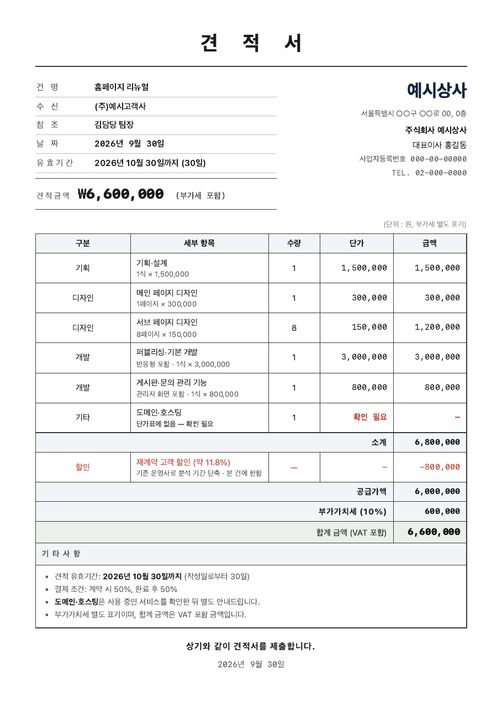

# 견적서 만들기 스킬 (Claude Code)

고객 요구사항 메모만 주면 **우리 회사 양식의 견적서 PDF**를 만들어 주는 [Claude Code](https://claude.com/claude-code) 스킬입니다.
도장 이미지를 한 번 저장해 두면 **직인까지 자동으로** 찍힙니다.

```
> ○○사 홈페이지 리뉴얼 견적서 만들어줘. 메인 1장, 서브 8장, 게시판 필요. 재계약이라 80만 원 할인.
```



> 📝 소개 글: [견적서 초안 자동화 따라 하기 — 메모 한 장이면 초안은 AI가, 확인은 사람이](https://blog.naver.com/lop12/224426794580) (Claude Code 없이 ChatGPT·Claude 대화창으로 따라 하는 방법도 있어요)

## 이 스킬의 원칙

- **단가를 지어내지 않습니다.** 모든 단가는 `prices.csv`(단가표)에서만 가져오고, 단가표에 없는 품목은 금액을 비운 채 **"확인 필요"** 로 표시합니다.
- **회사 정보는 한 곳에서만.** 상호·주소·사업자번호는 `company.md` 에만 적습니다. 여기저기 적어두면 한쪽만 고쳐져서 틀린 견적서가 나갑니다.
- **할인은 단가를 깎지 않고 별도 행으로.** 할인율과 사유를 함께 적습니다.
- **도장은 실제 도장 이미지로만.** 그림으로 그린 도장은 가짜 티가 납니다. 도장을 스캔한 이미지를 `assets/seal.png` 로 넣어두면 대표자 옆에 자동으로 직인이 찍히고, 없으면 빈칸으로 나갑니다.
- 만들어진 견적서는 **초안**입니다. 보내기 전에 사람이 확인해 주세요.

## 설치

필요한 것: Claude Code, Python 3, 크롬 또는 엣지(PDF 변환용)

```bash
git clone https://github.com/jungpasa-dev-team/claude-quote-skill.git
mkdir -p ~/.claude/skills
cp -r claude-quote-skill/quote ~/.claude/skills/quote
```

Windows는 `quote` 폴더를 `%USERPROFILE%\.claude\skills\quote` 로 복사하면 됩니다.

## 우리 회사에 맞게 고치기 (처음 한 번)

1. **`company.md`** — 회사명·대표자·사업자번호·주소·연락처를 적습니다. 예전 회사명이나 예전 주소가 있으면 "옛 표기"에 적어두세요. 견적서를 뽑은 뒤 그 말이 남아 있는지 검사합니다.
2. **`prices.csv`** — 우리 회사 품목과 단가로 바꿉니다. 엑셀에서 열어 고치고 CSV(UTF-8)로 저장하면 됩니다.
3. (선택) **도장 이미지** — `assets/seal.png` 로 저장해 두면 직인이 자동으로 찍힙니다. 아래 [도장(직인) 자동으로 넣기](#도장직인-자동으로-넣기)를 보세요.
4. (선택) **`assets/quote-template.html`** — 색·글꼴·표 모양을 바꾸고 싶으면 이 파일을 고칩니다. 기존에 쓰던 견적서 PDF를 Claude Code에 보여주고 "이 모양대로 양식을 바꿔줘"라고 해도 됩니다.

## 쓰는 법

Claude Code에서 평소처럼 말하면 됩니다.

```
> ○○사 견적서 만들어줘. (통화 메모나 고객 메일을 그대로 붙여도 됩니다)
> 부가세 포함 550만 원에 맞춰서 견적서 다시 만들어줘
> /quote ○○사 유지보수 월 견적
```

PDF만 따로 만들 때:

```bash
python3 ~/.claude/skills/quote/scripts/render.py 채운견적서.html 견적서.pdf
```

이때도 도장 이미지가 있으면 직인이 함께 찍힙니다.

## 도장(직인) 자동으로 넣기

도장 이미지를 정해진 자리에 **한 번만** 저장해 두면, 그다음부터 만드는 모든 견적서에 대표자 이름 옆 `(인)` 위로 직인이 찍힙니다.
파일이 없으면 도장 칸은 빈칸으로 나갑니다(예전과 같음).

**1) 도장 이미지 준비**

- 실제 도장을 흰 종이에 찍어 스캔하거나 사진을 찍습니다. 이미 도장이 찍힌 PDF 견적서에서 잘라 써도 됩니다.
- 도장 부분만 **정사각형에 가깝게** 잘라 주세요. 여백이 많으면 도장이 작게 찍힙니다.
- 배경이 투명한 **PNG**가 가장 깔끔합니다. 흰 바탕 그대로인 **JPG**도 됩니다 — 흰 부분은 투명하게 처리돼 글씨를 가리지 않습니다.

**2) 정해진 이름으로 저장**

| 운영체제 | 저장 위치 |
|---|---|
| macOS · Linux | `~/.claude/skills/quote/assets/seal.png` (또는 `seal.jpg`) |
| Windows | `%USERPROFILE%\.claude\skills\quote\assets\seal.png` (또는 `seal.jpg`) |

```bash
cp ~/Downloads/우리회사도장.png ~/.claude/skills/quote/assets/seal.png
```

Claude Code에 파일 경로를 주고 맡겨도 됩니다.

```
> ~/Downloads/우리회사도장.png 이거 견적서 도장으로 저장해줘
```

**3) 견적서 만들기** — 평소처럼 "견적서 만들어줘" 하면 직인이 찍힌 PDF가 나옵니다.

- 이번 견적서만 도장을 빼려면: `> 도장 빼고 만들어줘`
- 도장을 바꾸려면 `seal.png` 를 새 파일로 덮어쓰고, 그만 쓰려면 지우면 됩니다.
- 도장이 이름이나 사업자번호를 가리면 `assets/quote-template.html` 의 `.qh-right .seal` (크기 `width/height:50px`)을 조절하세요.

> ⚠️ **도장 이미지는 공개된 곳에 올리지 마세요.** 남이 가져가면 문서 위조에 쓰일 수 있습니다.
> 이 저장소를 포크해서 쓸 때 실수로 올라가지 않도록 `quote/assets/seal.*` 을 `.gitignore` 에 넣어 두었습니다.

## 이미 설치해 쓰고 있다면 (업데이트)

`cp -r` 로 폴더째 다시 복사하면 **직접 고친 `company.md`·`prices.csv` 가 예시로 덮어써집니다.** 아래 세 파일만 바꿔 주세요.

```bash
cd claude-quote-skill && git pull
cp quote/SKILL.md ~/.claude/skills/quote/
cp quote/assets/quote-template.html ~/.claude/skills/quote/assets/
cp quote/scripts/render.py ~/.claude/skills/quote/scripts/
```

양식(`quote-template.html`)을 직접 고쳐 쓰고 있었다면 덮어쓰지 말고, Claude Code에 "새 버전 템플릿의 도장 부분만 내 양식에 옮겨줘"라고 하면 됩니다.

## 폴더 구성

```
quote/
├── SKILL.md                     # Claude Code가 읽는 작업 규칙
├── company.md                   # 회사 고정 정보 (직접 수정)
├── prices.csv                   # 단가표 (직접 수정)
├── assets/quote-template.html   # A4 견적서 양식
├── assets/seal.png              # (선택) 도장 이미지 — 있으면 자동 날인, 저장소엔 올리지 않음
└── scripts/render.py            # HTML → PDF (표준 라이브러리만 사용)
examples/                        # 예시 견적서(가상의 회사·금액)
```

## 라이선스

MIT. 자유롭게 고쳐서 쓰세요. 예시의 회사·금액은 모두 가상입니다.
